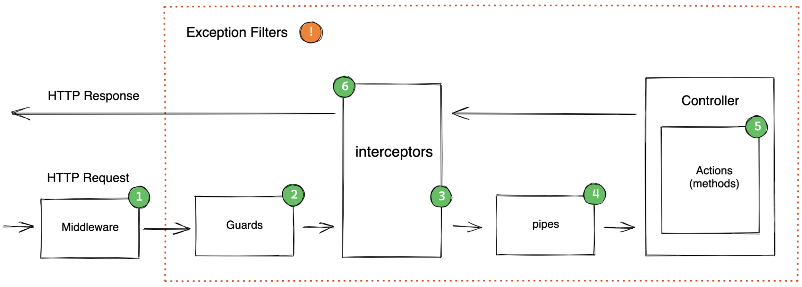

# Request lifecycle



> **More info:** https://slides.com/yariv-gilad/nest-js-request-lifecycle/fullscreen
> 
> **Official docs:** https://docs.nestjs.com/faq/request-lifecycle

## Pipe

### ValidationPipe

>built in NestJS

>Validating the request data

1. Tell Nest to use global validation
```ts
// main.ts
import { NestFactory } from '@nestjs/core';
import { AppModule } from './app.module';
import { ValidationPipe } from '@nestjs/common';

async function bootstrap() {
  const app = await NestFactory.create(AppModule);
  app.useGlobalPipes(new ValidationPipe({
    whitelist: true // <--- it will filter the request with the DTO (only the declared props will be presented in the request)
  }));
  await app.listen(process.env.BACKEND_API_PORT || 5000);
}
bootstrap();
```
> If we setup Pipes like this, it will cause some issues in the e2e tests. [Check the testing section of the notes.](./09-testing.md#e2e-testing-end-to-end-testing)

2. Create a class that describes the different properties that the request body should have (Dto -> Data transfer object)
```ts
// user/dtos/create-user.dto.ts
export class CreateUserDto {
  name: string;
  // all the properties which contain in the request
}
```
3. Add validation rules to the class
    - required dependencies: ```yarn add class-validator class-transformer```
    - ```class-validator```: validate the request with classes (https://github.com/typestack/class-validator)
    - ```class-transformer```: transform request json objets to classes (https://github.com/typestack/class-transformer)

```ts
// user/dtos/create-user.dto.ts
import { IsString } from 'class-validator';

export class CreateUserDto {
  @IsString()
  name: string;
}
```

4. Apply that class to the request handler
```ts
// user/user.controller.ts
import { Body, Controller, Post } from '@nestjs/common';
import { CreateUserDto } from './dtos/create-user.dto';

@Controller('user')
export class UserController {
  constructor() {}

  @Post()
  createUser(@Body() body: CreateUserDto) {
    console.log(body);
  }
}
```

## Guard

## Controller

> Handle requests


## Service
- Business logic
- initialize in the controller constructor as arguments: ```constructor(private userService: UserService) {}```
- needed the ```@Injectable()``` decorator

## Repository
> Read and write to the database