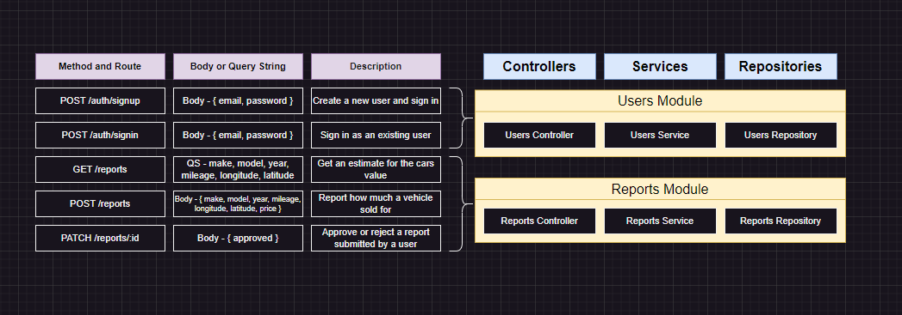

# Modules in NestJS

- modules are isolated from each others
- modules holds together controller, service and repository
- modules can share each resources

## Sharing Service between modules

1. export the service from the source module
2. import the module into the target module
3. inject the service into the target module service

## Designing Modules

