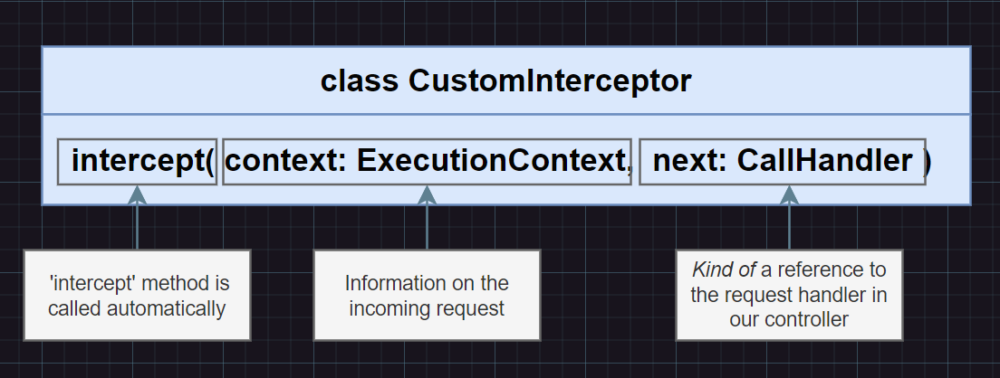

# Class Serializer Interceptor

Serialization is a process that happens before objects are returned in a network response. This is an appropriate place to provide rules for transforming and sanitizing the data to be returned to the client. For example, sensitive data like passwords should always be excluded from the response. Or, certain properties might require additional transformation, such as sending only a subset of properties of an entity. Performing these transformations manually can be tedious and error prone, and can leave you uncertain that all cases have been covered.

- Interceptors can mess around with incoming requests and/or  outgoing  responses
- Interceptors can be applied to a single handler, all the handlers in a controller, or globally

## Built In Interceptor

Nest provides a built-in capability to help ensure that these operations can be performed in a straightforward way. The ClassSerializerInterceptor interceptor uses the powerful class-transformer package to provide a declarative and extensible way of transforming objects. The basic operation it performs is to take the value returned by a method handler and apply the instanceToPlain() function from class-transformer. In doing so, it can apply rules expressed by class-transformer decorators on an entity/DTO class, as described below.

### Basic solution to remove password from response

```ts
// user/user.entity.ts
import { Exclude } from 'class-transformer';

export class UserEntity {
  id: number;
  firstName: string;
  lastName: string;

  @Exclude()
  password: string;
}

// user/user.controller.ts
@UseInterceptors(ClassSerializerInterceptor)
@Get()
findOne(): UserEntity {
  return new UserEntity({
    id: 1,
    firstName: 'Kamil',
    lastName: 'Mysliwiec',
    password: 'password',
  });
}
```

## Custom Interceptors



### Advanced solution to remove password field from the response

1. Create custom interceptor

```ts
// src/interceptors/serialize.interceptor.ts

import {
  UseInterceptors,
  NestInterceptor,
  ExecutionContext,
  CallHandler,
} from '@nestjs/common';

import { Observable } from 'rxjs';
import { map } from 'rxjs/operators';
import { plainToInstance } from 'class-transformer';

export class SerializeInterceptor implements NestInterceptor {
  constructor(private dto: any) {}

  intercept(context: ExecutionContext, handler: CallHandler): Observable<any> {
    // Run something before a request handled by the request handler

    return handler.handle().pipe(
      map((data: any) => {
        // Run something before the response is sent out
        plainToInstance(this.dto, data, {
          excludeExtraneousValues: true,
        });
      }),
    );
  }
}
```
2. Then create the default UserDto

```ts
// users/user.dto.ts

import { Expose } from 'class-transformer';

export class UserDto {
  @Expose() 
  id: string;

  @Expose()
  email: string;
}

```

3. Use with custom decorator

```ts
// src/interceptors/serialize.interceptor.ts

export function Serialize(dto: any) {
  return UseInterceptors(new SerializeInterceptor(dto));
}
```

Only class type to dto param

```ts
interface ClassConstructor {
  new (...args: any[]): {};
}

export function Serialize(dto: ClassConstructor) {
  return UseInterceptors(new SerializeInterceptor(dto));
}
```

4. Then use in controller

```ts
@Serialize(UserDto)
@Get('/:id')
findUser(@Param('id') id: string) {
    return this.usersService.findOne(id);
}
```

### Applying controller wide interceptor
- Just use the ```Serialize``` decorator on the controller class
- It can be use in the methods also with different dto
  
```ts
@Controller('auth')
@Serialize(UserDto)
export class UsersController {
    ...
}
```

### Globaly scoped interceptor

In the parent module providers proprety:
```ts
import { APP_INTERCEPTOR } from '@nestjs/core';

...

@Module({
  ...
  providers: [
    { provide: APP_INTERCEPTOR, useClass: CurrentUserInterceptor },
  ],
})
export class UsersModule {}
```


---

#### [More info about interceptors](https://docs.nestjs.com/techniques/serialization)