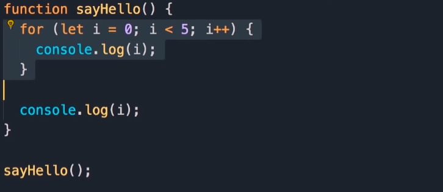

# ES6 features

## let vs var vs const

- ```let``` only accessible the current block (ex.: for loop), prefer this if you have to re assigne the variable
- ```var``` accessible in the entire function

- ```const``` read only variable, accessible in the current block, prefer this if you dont want to re assigne the variable
